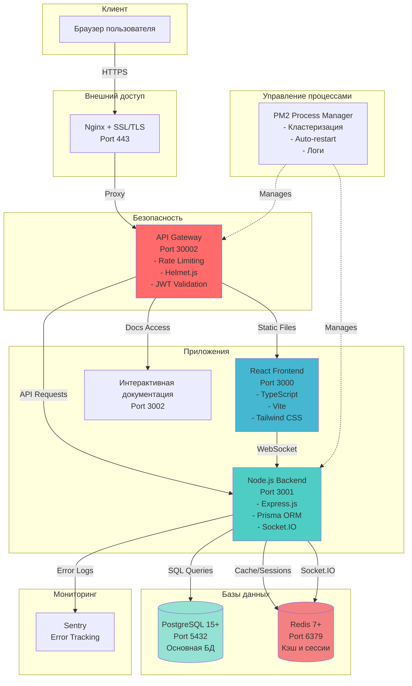
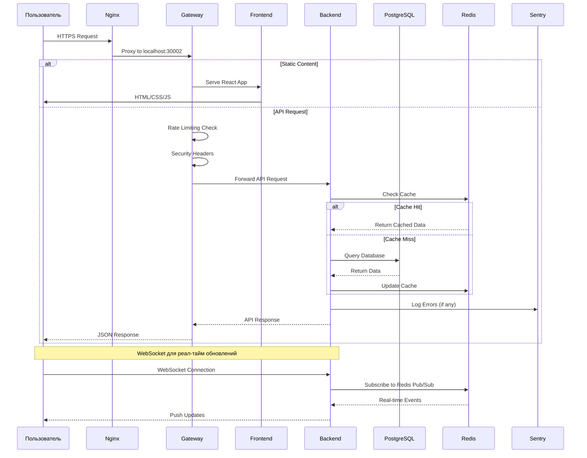
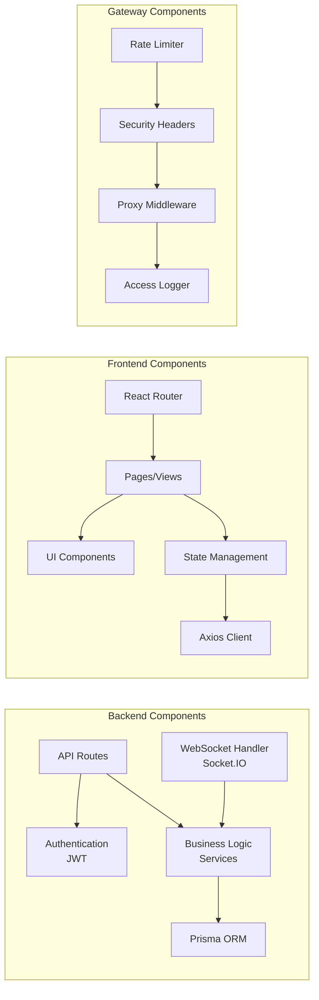
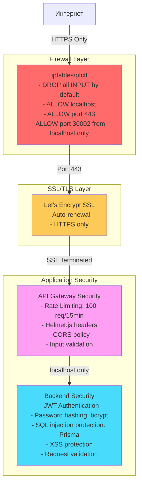
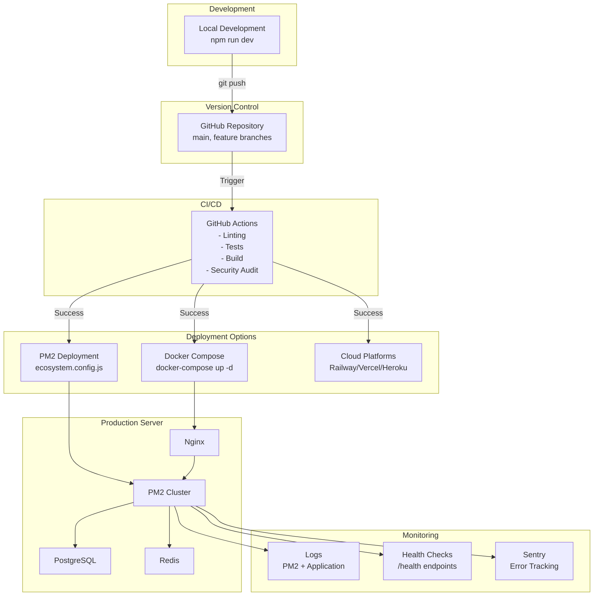
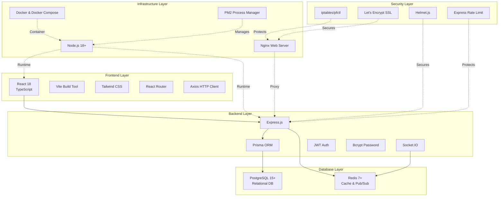
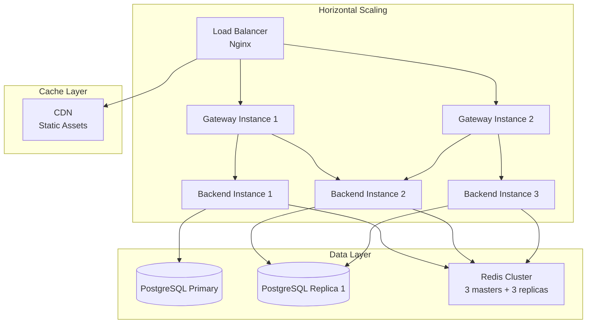

# KPI Productivity System - Архитектура

## Общая архитектура системы

## Поток данных

## Структура компонентов

## Схема безопасности

## Схема деплоймента

## Технологический стек по уровням

## Порты и доступ

| Сервис | Порт | Доступ | Описание |
|--------|------|--------|----------|
| Nginx | 443 | Внешний | HTTPS вход (production) |
| Nginx | 80 | Внешний | HTTP редирект на HTTPS |
| Gateway | 30002 | localhost only | Единственная точка входа |
| Frontend | 3000 | localhost only | React dev server |
| Backend | 3001 | localhost only | API server |
| Docs | 3002 | localhost only | Documentation server |
| PostgreSQL | 5432 | localhost only | Database |
| Redis | 6379 | localhost only | Cache & sessions |

## Особенности безопасности

### 1. Сетевая изоляция
- ✅ Только Gateway (port 30002) доступен через localhost
- ✅ Все остальные порты заблокированы firewall
- ✅ Nginx проксирует на Gateway
- ✅ SSL/TLS для внешних соединений

### 2. Application Security
- ✅ JWT authentication на всех API endpoints
- ✅ Rate limiting: 100 запросов за 15 минут
- ✅ Helmet.js для security headers
- ✅ Input validation на всех входящих данных
- ✅ SQL injection protection через Prisma ORM
- ✅ XSS protection
- ✅ CORS политика

### 3. Мониторинг и логирование
- ✅ Sentry для отслеживания ошибок
- ✅ Детальные access logs
- ✅ Health check endpoints
- ✅ Redis и PostgreSQL мониторинг

## Схема масштабирования

## Производительность

### Целевые метрики
- **Response Time**: < 200ms средний ответ API
- **Uptime**: 99.9% доступность
- **Concurrent Users**: 1000+ одновременных пользователей
- **Database**: < 100ms на запрос
- **Cache Hit Rate**: > 80%

### PM2 Кластеризация
- **Backend**: max instances (по числу CPU cores)
- **Gateway**: 2 instances
- **Auto-restart**: при сбое или превышении памяти
- **Max Memory**: 1GB для backend, 512MB для gateway

## Ключевые эндпоинты

### Backend API
- `POST /api/auth/login` - Аутентификация
- `POST /api/auth/register` - Регистрация
- `GET /api/habits` - Получить привычки
- `POST /api/habits` - Создать привычку
- `GET /api/kpi` - Расчет KPI
- `GET /api/teams` - Команды
- `GET /api/health` - Health check
- `GET /api/health/detailed` - Детальный health check

### Gateway
- `GET /health` - Gateway health
- `*` - Proxy к backend/frontend

### WebSocket Events
- `habit:created` - Новая привычка создана
- `habit:updated` - Привычка обновлена
- `kpi:calculated` - KPI пересчитан
- `team:updated` - Команда обновлена

## Требования к окружению

### Development
- Node.js 18+
- PostgreSQL 15+
- Redis 7+
- npm или yarn

### Production
- Ubuntu 20.04+ или аналогичный Linux
- Node.js 18+
- PostgreSQL 15+ с репликацией
- Redis 7+ cluster
- Nginx с SSL
- PM2 для process management
- Docker (опционально)
- Minimum 2GB RAM, 2 CPU cores

---

**Создано для**: KPI Productivity GitHub Release
**Версия**: 1.0.0
**Дата**: 2026-01-13
