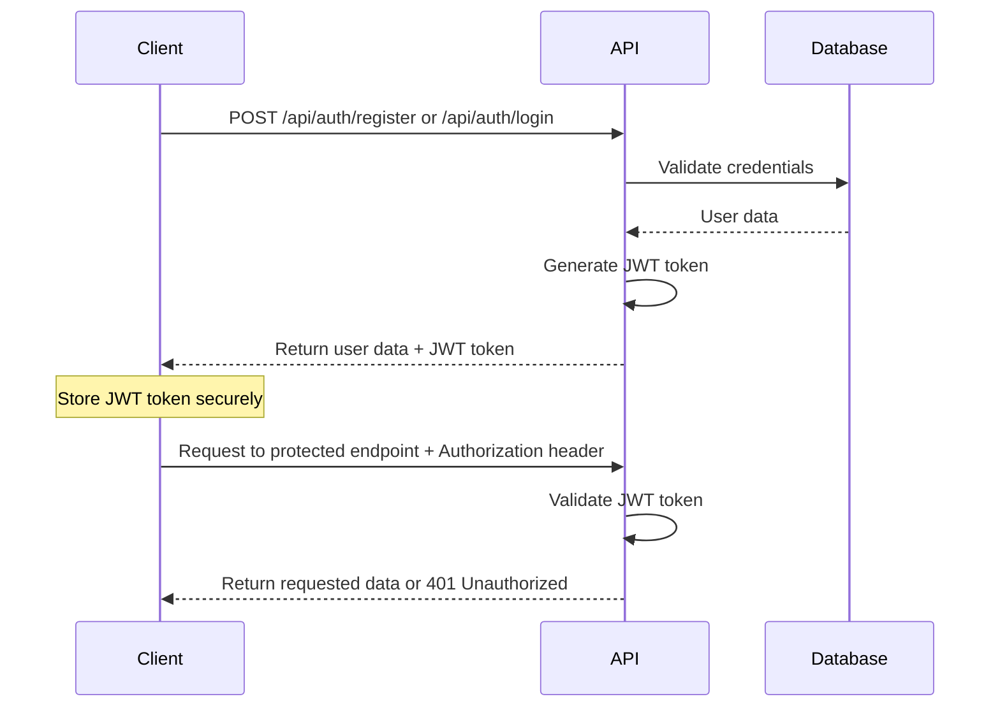

# Authentication and Authorization Guide

## Overview

The KPI Productivity API uses JWT (JSON Web Tokens) for authentication and authorization. This guide covers all aspects of user authentication, session management, and protected route access.

## Table of Contents

1. [Authentication Flow](#authentication-flow)
2. [User Registration](#user-registration)
3. [User Login](#user-login)
4. [JWT Token Management](#jwt-token-management)
5. [Protected Routes](#protected-routes)
6. [Token Refresh](#token-refresh)
7. [Session Management](#session-management)
8. [Security Best Practices](#security-best-practices)
9. [Error Handling](#error-handling)
10. [Code Examples](#code-examples)

## Authentication Flow

The authentication system follows a standard JWT-based flow:



## User Registration

### Endpoint
```
POST /api/auth/register
```

### Request Body
```json
{
  "email": "user@example.com",
  "password": "securePassword123",
  "name": "John Doe" // optional
}
```

### Validation Rules
- **email**: Must be a valid email format
- **password**: Minimum 6 characters
- **name**: Optional display name

### Response
```json
{
  "message": "User created successfully",
  "user": {
    "id": "user-uuid",
    "email": "user@example.com",
    "name": "John Doe",
    "createdAt": "2024-01-01T00:00:00.000Z"
  },
  "token": "eyJhbGciOiJIUzI1NiIsInR5cCI6IkpXVCJ9..."
}
```

### Error Responses
- **400 Bad Request**: Invalid input or user already exists
- **500 Internal Server Error**: Server error

### Example Usage

#### JavaScript/Fetch
```javascript
const registerUser = async (userData) => {
  try {
    const response = await fetch('http://localhost:3001/api/auth/register', {
      method: 'POST',
      headers: {
        'Content-Type': 'application/json'
      },
      body: JSON.stringify(userData)
    });

    if (!response.ok) {
      const error = await response.json();
      throw new Error(error.error || 'Registration failed');
    }

    const data = await response.json();
    
    // Store token securely
    localStorage.setItem('authToken', data.token);
    localStorage.setItem('user', JSON.stringify(data.user));
    
    return data;
  } catch (error) {
    console.error('Registration error:', error);
    throw error;
  }
};

// Usage
registerUser({
  email: 'user@example.com',
  password: 'securePassword123',
  name: 'John Doe'
});
```

#### cURL
```bash
curl -X POST http://localhost:3001/api/auth/register \
  -H "Content-Type: application/json" \
  -d '{
    "email": "user@example.com",
    "password": "securePassword123",
    "name": "John Doe"
  }'
```

## User Login

### Endpoint
```
POST /api/auth/login
```

### Request Body
```json
{
  "email": "user@example.com",
  "password": "securePassword123"
}
```

### Response
```json
{
  "message": "Login successful",
  "user": {
    "id": "user-uuid",
    "email": "user@example.com",
    "name": "John Doe",
    "createdAt": "2024-01-01T00:00:00.000Z"
  },
  "token": "eyJhbGciOiJIUzI1NiIsInR5cCI6IkpXVCJ9..."
}
```

### Error Responses
- **401 Unauthorized**: Invalid credentials
- **400 Bad Request**: Invalid input format
- **500 Internal Server Error**: Server error

### Example Usage

#### JavaScript/Fetch
```javascript
const loginUser = async (credentials) => {
  try {
    const response = await fetch('http://localhost:3001/api/auth/login', {
      method: 'POST',
      headers: {
        'Content-Type': 'application/json'
      },
      body: JSON.stringify(credentials)
    });

    if (!response.ok) {
      const error = await response.json();
      throw new Error(error.error || 'Login failed');
    }

    const data = await response.json();
    
    // Store token securely
    localStorage.setItem('authToken', data.token);
    localStorage.setItem('user', JSON.stringify(data.user));
    
    return data;
  } catch (error) {
    console.error('Login error:', error);
    throw error;
  }
};

// Usage
loginUser({
  email: 'user@example.com',
  password: 'securePassword123'
});
```

## JWT Token Management

### Token Structure
JWT tokens contain the following payload:
```json
{
  "userId": "user-uuid",
  "iat": 1640995200,
  "exp": 1641081600
}
```

### Token Expiration
- Default expiration: 24 hours
- Tokens are automatically validated on each request
- Expired tokens return 401 Unauthorized

### Token Storage Best Practices

#### Client-Side Storage Options

1. **localStorage** (Simple but less secure)
```javascript
// Store token
localStorage.setItem('authToken', token);

// Retrieve token
const token = localStorage.getItem('authToken');

// Remove token
localStorage.removeItem('authToken');
```

2. **sessionStorage** (More secure, expires with session)
```javascript
// Store token
sessionStorage.setItem('authToken', token);

// Retrieve token
const token = sessionStorage.getItem('authToken');
```

3. **HTTP-only Cookies** (Most secure, requires server setup)
```javascript
// Server sets cookie (recommended for production)
res.cookie('authToken', token, {
  httpOnly: true,
  secure: true,
  sameSite: 'strict',
  maxAge: 24 * 60 * 60 * 1000 // 24 hours
});
```

## Protected Routes

All API endpoints except authentication and health checks require a valid JWT token.

### Authorization Header Format
```
Authorization: Bearer <jwt-token>
```

### Example Protected Request
```javascript
const makeAuthenticatedRequest = async (endpoint, options = {}) => {
  const token = localStorage.getItem('authToken');
  
  if (!token) {
    throw new Error('No authentication token found');
  }

  const response = await fetch(`http://localhost:3001${endpoint}`, {
    ...options,
    headers: {
      'Authorization': `Bearer ${token}`,
      'Content-Type': 'application/json',
      ...options.headers
    }
  });

  if (response.status === 401) {
    // Token expired or invalid
    localStorage.removeItem('authToken');
    localStorage.removeItem('user');
    throw new Error('Authentication expired. Please login again.');
  }

  return response;
};

// Usage
const habits = await makeAuthenticatedRequest('/api/habits');
```

### Get Current User Information

#### Endpoint
```
GET /api/auth/me
```

#### Headers
```
Authorization: Bearer <jwt-token>
```

#### Response
```json
{
  "user": {
    "id": "user-uuid",
    "email": "user@example.com",
    "name": "John Doe",
    "createdAt": "2024-01-01T00:00:00.000Z"
  }
}
```

#### Example Usage
```javascript
const getCurrentUser = async () => {
  try {
    const response = await makeAuthenticatedRequest('/api/auth/me');
    const data = await response.json();
    return data.user;
  } catch (error) {
    console.error('Failed to get current user:', error);
    throw error;
  }
};
```

## Token Refresh

Currently, the API uses long-lived tokens (24 hours). For enhanced security, implement token refresh:

### Recommended Implementation Pattern
```javascript
class AuthService {
  constructor() {
    this.token = localStorage.getItem('authToken');
    this.refreshToken = localStorage.getItem('refreshToken');
  }

  async makeRequest(endpoint, options = {}) {
    let token = this.getToken();
    
    if (this.isTokenExpired(token)) {
      token = await this.refreshAccessToken();
    }

    const response = await fetch(endpoint, {
      ...options,
      headers: {
        'Authorization': `Bearer ${token}`,
        ...options.headers
      }
    });

    if (response.status === 401) {
      // Try to refresh token
      token = await this.refreshAccessToken();
      
      // Retry request with new token
      return fetch(endpoint, {
        ...options,
        headers: {
          'Authorization': `Bearer ${token}`,
          ...options.headers
        }
      });
    }

    return response;
  }

  isTokenExpired(token) {
    if (!token) return true;
    
    try {
      const payload = JSON.parse(atob(token.split('.')[1]));
      return payload.exp * 1000 < Date.now();
    } catch {
      return true;
    }
  }

  async refreshAccessToken() {
    // Implementation depends on refresh token endpoint
    // This is a placeholder for future implementation
    throw new Error('Token refresh not implemented');
  }

  getToken() {
    return this.token || localStorage.getItem('authToken');
  }

  setToken(token) {
    this.token = token;
    localStorage.setItem('authToken', token);
  }

  clearTokens() {
    this.token = null;
    this.refreshToken = null;
    localStorage.removeItem('authToken');
    localStorage.removeItem('refreshToken');
    localStorage.removeItem('user');
  }
}

// Usage
const authService = new AuthService();
```

## Session Management

### Login State Management
```javascript
class SessionManager {
  constructor() {
    this.user = null;
    this.token = null;
    this.loadSession();
  }

  loadSession() {
    const token = localStorage.getItem('authToken');
    const userData = localStorage.getItem('user');
    
    if (token && userData) {
      this.token = token;
      this.user = JSON.parse(userData);
    }
  }

  login(userData, token) {
    this.user = userData;
    this.token = token;
    
    localStorage.setItem('authToken', token);
    localStorage.setItem('user', JSON.stringify(userData));
  }

  logout() {
    this.user = null;
    this.token = null;
    
    localStorage.removeItem('authToken');
    localStorage.removeItem('user');
  }

  isAuthenticated() {
    return !!(this.token && this.user);
  }

  getUser() {
    return this.user;
  }

  getToken() {
    return this.token;
  }
}

// Usage
const sessionManager = new SessionManager();

if (sessionManager.isAuthenticated()) {
  console.log('User is logged in:', sessionManager.getUser());
} else {
  console.log('User is not authenticated');
}
```

## Security Best Practices

### 1. Token Storage
- **Development**: localStorage is acceptable
- **Production**: Use HTTP-only cookies or secure storage
- Never store tokens in plain text files or version control

### 2. HTTPS Only
```javascript
// Always use HTTPS in production
const API_BASE_URL = process.env.NODE_ENV === 'production' 
  ? 'https://your-api-domain.com'
  : 'http://localhost:3001';
```

### 3. Token Validation
```javascript
const validateToken = (token) => {
  if (!token) return false;
  
  try {
    const payload = JSON.parse(atob(token.split('.')[1]));
    
    // Check expiration
    if (payload.exp * 1000 < Date.now()) {
      return false;
    }
    
    // Check required fields
    if (!payload.userId) {
      return false;
    }
    
    return true;
  } catch {
    return false;
  }
};
```

### 4. Automatic Logout on Token Expiry
```javascript
const setupTokenExpiryCheck = () => {
  setInterval(() => {
    const token = localStorage.getItem('authToken');
    
    if (token && !validateToken(token)) {
      // Token expired, logout user
      sessionManager.logout();
      window.location.href = '/login';
    }
  }, 60000); // Check every minute
};
```

### 5. Request Interceptors
```javascript
// Axios interceptor example
axios.interceptors.request.use(
  (config) => {
    const token = localStorage.getItem('authToken');
    if (token) {
      config.headers.Authorization = `Bearer ${token}`;
    }
    return config;
  },
  (error) => Promise.reject(error)
);

axios.interceptors.response.use(
  (response) => response,
  (error) => {
    if (error.response?.status === 401) {
      // Token expired or invalid
      sessionManager.logout();
      window.location.href = '/login';
    }
    return Promise.reject(error);
  }
);
```

## Error Handling

### Common Authentication Errors

#### 401 Unauthorized
```json
{
  "error": "Unauthorized",
  "message": "Invalid or expired token"
}
```

**Handling:**
```javascript
if (response.status === 401) {
  // Clear stored authentication data
  localStorage.removeItem('authToken');
  localStorage.removeItem('user');
  
  // Redirect to login
  window.location.href = '/login';
}
```

#### 400 Bad Request (Registration/Login)
```json
{
  "error": "Invalid input",
  "details": [
    {
      "code": "invalid_type",
      "expected": "string",
      "received": "undefined",
      "path": ["email"],
      "message": "Required"
    }
  ]
}
```

**Handling:**
```javascript
const handleValidationErrors = (errorResponse) => {
  if (errorResponse.details) {
    const fieldErrors = {};
    errorResponse.details.forEach(error => {
      const field = error.path[0];
      fieldErrors[field] = error.message;
    });
    return fieldErrors;
  }
  return { general: errorResponse.error };
};
```

## Code Examples

### Complete Authentication Hook (React)
```javascript
import { useState, useEffect, useContext, createContext } from 'react';

const AuthContext = createContext();

export const useAuth = () => {
  const context = useContext(AuthContext);
  if (!context) {
    throw new Error('useAuth must be used within an AuthProvider');
  }
  return context;
};

export const AuthProvider = ({ children }) => {
  const [user, setUser] = useState(null);
  const [token, setToken] = useState(null);
  const [loading, setLoading] = useState(true);

  useEffect(() => {
    // Load saved authentication state
    const savedToken = localStorage.getItem('authToken');
    const savedUser = localStorage.getItem('user');
    
    if (savedToken && savedUser) {
      setToken(savedToken);
      setUser(JSON.parse(savedUser));
    }
    
    setLoading(false);
  }, []);

  const login = async (credentials) => {
    try {
      const response = await fetch('http://localhost:3001/api/auth/login', {
        method: 'POST',
        headers: {
          'Content-Type': 'application/json'
        },
        body: JSON.stringify(credentials)
      });

      if (!response.ok) {
        const error = await response.json();
        throw new Error(error.error || 'Login failed');
      }

      const data = await response.json();
      
      setUser(data.user);
      setToken(data.token);
      
      localStorage.setItem('authToken', data.token);
      localStorage.setItem('user', JSON.stringify(data.user));
      
      return data;
    } catch (error) {
      console.error('Login error:', error);
      throw error;
    }
  };

  const register = async (userData) => {
    try {
      const response = await fetch('http://localhost:3001/api/auth/register', {
        method: 'POST',
        headers: {
          'Content-Type': 'application/json'
        },
        body: JSON.stringify(userData)
      });

      if (!response.ok) {
        const error = await response.json();
        throw new Error(error.error || 'Registration failed');
      }

      const data = await response.json();
      
      setUser(data.user);
      setToken(data.token);
      
      localStorage.setItem('authToken', data.token);
      localStorage.setItem('user', JSON.stringify(data.user));
      
      return data;
    } catch (error) {
      console.error('Registration error:', error);
      throw error;
    }
  };

  const logout = () => {
    setUser(null);
    setToken(null);
    localStorage.removeItem('authToken');
    localStorage.removeItem('user');
  };

  const makeAuthenticatedRequest = async (endpoint, options = {}) => {
    if (!token) {
      throw new Error('No authentication token');
    }

    const response = await fetch(`http://localhost:3001${endpoint}`, {
      ...options,
      headers: {
        'Authorization': `Bearer ${token}`,
        'Content-Type': 'application/json',
        ...options.headers
      }
    });

    if (response.status === 401) {
      logout();
      throw new Error('Authentication expired');
    }

    return response;
  };

  const value = {
    user,
    token,
    loading,
    login,
    register,
    logout,
    makeAuthenticatedRequest,
    isAuthenticated: !!(user && token)
  };

  return (
    <AuthContext.Provider value={value}>
      {children}
    </AuthContext.Provider>
  );
};
```

### Protected Route Component (React)
```javascript
import { Navigate } from 'react-router-dom';
import { useAuth } from './AuthContext';

const ProtectedRoute = ({ children }) => {
  const { isAuthenticated, loading } = useAuth();

  if (loading) {
    return <div>Loading...</div>;
  }

  if (!isAuthenticated) {
    return <Navigate to="/login" replace />;
  }

  return children;
};

export default ProtectedRoute;
```

### API Service Class
```javascript
class ApiService {
  constructor() {
    this.baseURL = 'http://localhost:3001';
  }

  async request(endpoint, options = {}) {
    const token = localStorage.getItem('authToken');
    
    const config = {
      ...options,
      headers: {
        'Content-Type': 'application/json',
        ...(token && { 'Authorization': `Bearer ${token}` }),
        ...options.headers
      }
    };

    const response = await fetch(`${this.baseURL}${endpoint}`, config);

    if (response.status === 401) {
      // Handle authentication error
      localStorage.removeItem('authToken');
      localStorage.removeItem('user');
      window.location.href = '/login';
      throw new Error('Authentication required');
    }

    if (!response.ok) {
      const error = await response.json();
      throw new Error(error.error || 'Request failed');
    }

    return response.json();
  }

  // Authentication methods
  async login(credentials) {
    return this.request('/api/auth/login', {
      method: 'POST',
      body: JSON.stringify(credentials)
    });
  }

  async register(userData) {
    return this.request('/api/auth/register', {
      method: 'POST',
      body: JSON.stringify(userData)
    });
  }

  async getCurrentUser() {
    return this.request('/api/auth/me');
  }

  // Protected resource methods
  async getHabits() {
    return this.request('/api/habits');
  }

  async createHabit(habitData) {
    return this.request('/api/habits', {
      method: 'POST',
      body: JSON.stringify(habitData)
    });
  }
}

export default new ApiService();
```

This comprehensive authentication guide covers all aspects of JWT-based authentication in the KPI Productivity API, including practical examples and security best practices.